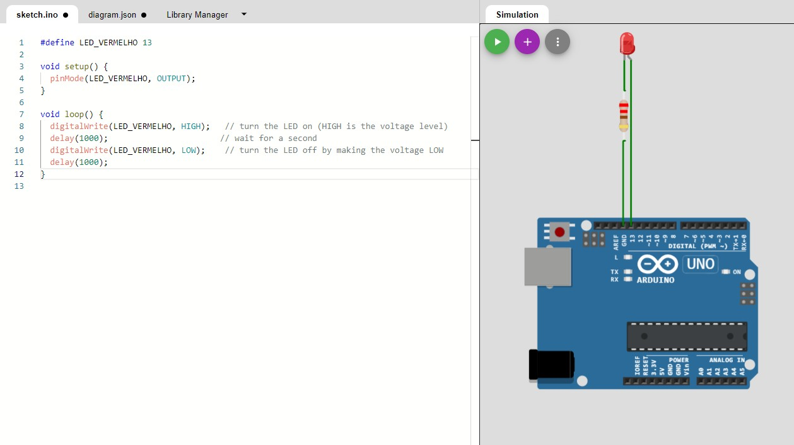
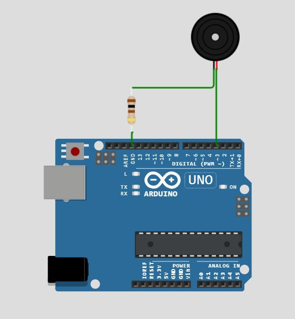
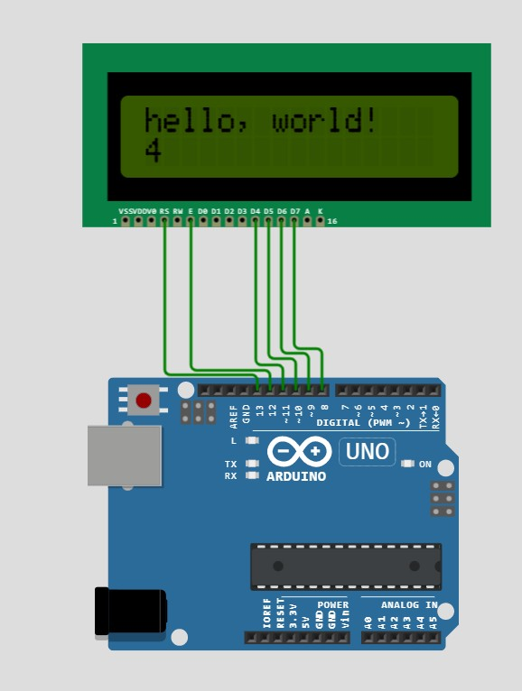
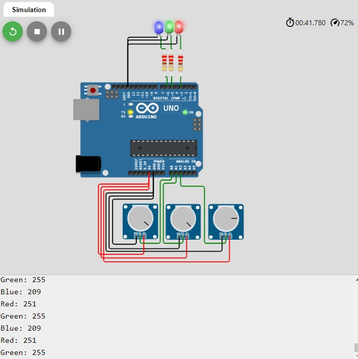
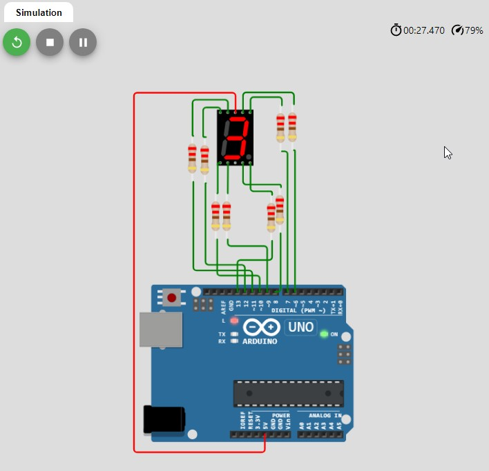
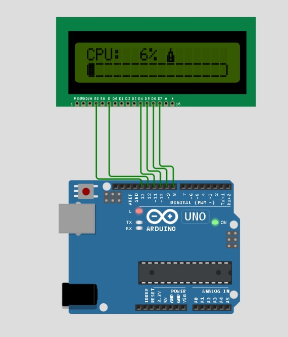
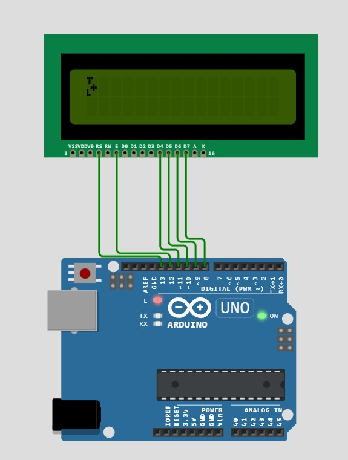
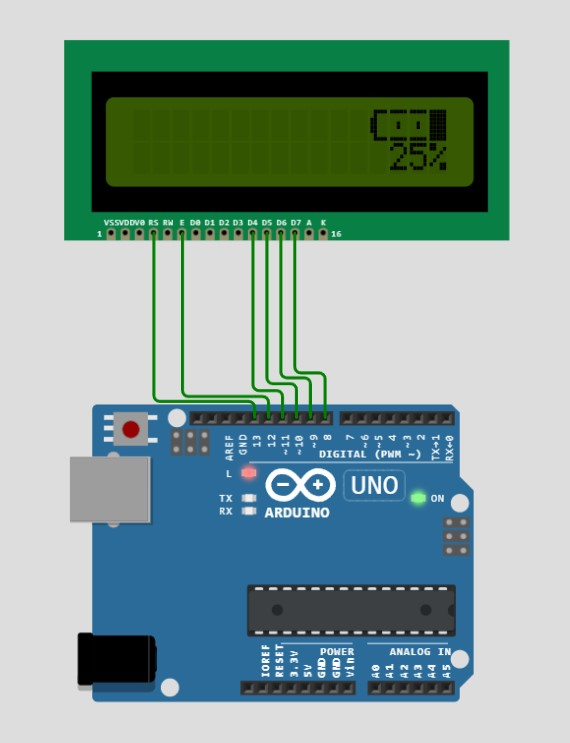
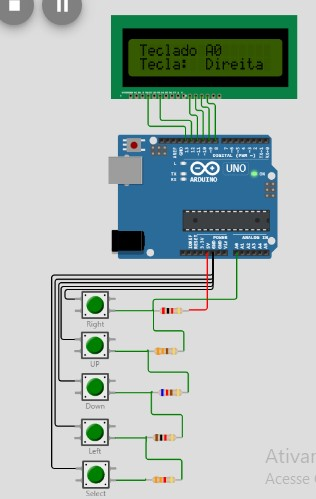
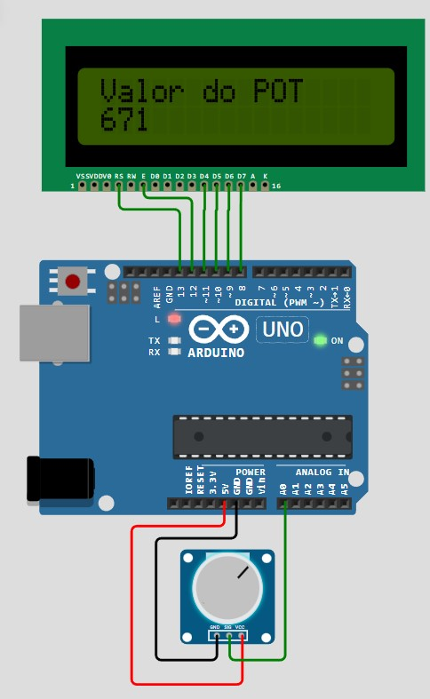

# ARDUINO

## PROGRAMA

```CMD
Legacy
https://downloads.arduino.cc/arduino-1.8.19-windows.exe

```

## Simuladores

```txt
https://sites.google.com/site/unoardusim/simulator-download
https://xevro.be/products/arduino-simulator-windows-free.html
https://simulide.com/p/
https://www.flowcode.co.uk/
https://github.com/lcgamboa/picsimlab

```

## CIRCUITOS

```CMD
Clique no nome para abrir o exemplo no site.
Clique na imagem para abrir o vídeo.
```

|Links        |Telas        |
|---          |---          |
| [001.blink](https://wokwi.com/projects/337221498511032914) | [](https://www.youtube.com/watch?v=zo43gnE7tpo) |
| [002.sos](https://wokwi.com/projects/337666895110996563) |  |
| [003.lcd](https://wokwi.com/projects/337220789451358803) |  |
| [004.rgb_fade](https://wokwi.com/projects/337724860009546323) |  |
| [005.display_7seg](https://wokwi.com/projects/337726629069455955) |  |
| [006.lcd_bargraph](https://wokwi.com/projects/347142172950135379) |  |
| [007.lcd_char](https://wokwi.com/projects/347144788933345875) |  |
| [008.lcd_bateria](https://wokwi.com/projects/347187838483169874) |  |
| [009.btnA0](https://wokwi.com/projects/347250932734493267) |  |
| [019.pot](https://wokwi.com/projects/457128068446743553) |  |

## Links

```CMD
Construtor de ícone para Arduino
https://maxpromer.github.io/LCD-Character-Creator/

```

## Windows

### Placa não genuína
Algumas placas não são reconhecidas pelo windows e deve seguir:<br>
Painel de controle, Sistema, Gerenciador de Dispositivos. Veja qual foi o dispositivo que foi iniciado.<br>
Procure o driver dentro da pasta do arduino. Terá de fazer o passo duas vezes (FTDI e USB).<br>
Até a versão 1.8.15 da IDE Arduino, ele aceita placas paralelas. A versão 2.0 e acima não aceitam.<br>

## Linux
https://www.arduino.cc/en/Main/Software<br>
https://hardwarelivreusp.org/tutoriais/2016/11/20/arduino-4linux/<br>

### Placa não genuína
Pra saber se é 32 ou 64 (x86_64) bits
```
uname -m
```
Baixe o arquivo manualmente e extraia numa pasta:<br>

Descompactar, acessar e instalar:<br>
```
cd arduino-1.8.13/
./install.sh
```
Dar permissão na porta serial:<br>
```
ls -l /dev/ttyACM*
ls -l /dev/ttyUSB*
```
Vai aparecer algo como:<br>
```
crw-rw----. 1 root dialout 188, 0 Ago 29 21:34 /dev/ttyUSB0
```
Dar acesso ao grupo:<br>
```
sudo usermod -a -G dialout <username>
```
Faça o logout e o login:<br>

## vcpkg
```
git clone  https://github.com/Microsoft/vcpkg
cd vcpkg
./bootstrap-vcpkg.sh
sudo yum install centos-release-scl
sudo yum install devtoolset-7
scl enable devtoolset-7 bash
```

## Task Lists
- [x] Write the press release
- [ ] Update the website
- [ ] Contact the media

## Footnotes
Here's a simple footnote,[^1] and here's a longer one.[^bignote]

[^1]: This is the first footnote.
[^bignote]: Here's one with multiple paragraphs and code.
Indent paragraphs to include them in the footnote.

`{ my code }`

Add as many paragraphs as you like.


## Syntax Highlighting
```json
{
"firstName": "John",
"lastName": "Smith",
"age": 25
}
```


## Fenced Code Blocks
```
{
"firstName": "John",
"lastName": "Smith",
"age": 25
}
```

#Escaping Characters
\* Without the backslash, this would be a bullet in an unordered list.

## backslash
You can use a backslash to escape the following characters.

| Character | Name | xxxxxxx |
| :--- | :----: | ---: |
| \ | backslash | x |
| ` | tickmark | x |
| * | asterisk | x |
| _ | underscore | xx |
| {} | curly braces | xxx |
| [] | brackets | xx |
| () | parentheses | x |

# pound sign
+ plus sign
- minus sign (hyphen)
. dot
! exclamation mark


---

## Links
Use [Duck Duck Go](https://duckduckgo.com).

## Tiles
Use [Duck Duck Go](https://duckduckgo.com "My search engine!").

## URLs and Email Addresses
<https://eff.org>
<fake@example.com>


## Formatting Links
I love supporting **[EFF](https://eff.org)**.
This is the *[EFF](https://eff.org)*.

---
# TABELA

| Syntax | Description |
| ----------- | ----------- |
| Header | Title |
| Paragraph | Text |

---
## BOLD
I love **bold text**.
I love __bold text__.
Love**is**bold

## ITALIC
The *cat's meow*.

## BOLD AND ITALIC
***Important*** text
___Important___ text
__*Important*__ text.
**_Important_** text.

## Blockquotes
> Dorothy followed her through many rooms.

### Blockquotes with Multiple Paragraphs
> This the first paragraph.
>
> And this is the second paragraph.

### Nested Blockquotes
> This the first paragraph.
>
>> And this is the nested paragraph.

### Blockquotes with Other Elements
> ##### The quarterly results look great!
>
> - Revenue was off the chart.
> - Profits were higher than ever.
>
> *Everything* is going **well**.

# Lists
## Ordered Lists
1. First item
2. Second item
3. Third item
4. Fourth item

1. First item
1. Second item
1. Third item
1. Fourth item

1. First item
8. Second item
3. Third item
5. Fourth item

## Nested Lists
1. First item
2. Second item
3. Third item
    1. Indented item
    2. Indented item
4. Fourth item

## Unordered Lists
- First item
- Second item
- Third item
- Fourth item

* First item
* Second item
* Third item
* Fourth item

 + First item
 * Second item
 - Third item
 + Fourth item

## Nesting List Items
- First item
- Second item
- Third item
    - Indented item
    - Indented item
- Fourth item

## Code
At the command prompt, type `nano`.

``Use `code` in your Markdown file.``

#### Heading level 4
##### Heading level 5
###### Heading level 6

```CMD
https://renatomportugal.github.io/06.arduino/
```
